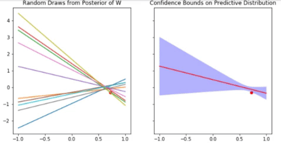

This article will attempt to introduce the topic of Bayesian Linear Regression. We will walk through the math and the code as well. The complete Jupyter notebook is available [here][Jupyter]. 

In the end, I picked up Chris Bishop's awesome book [PRML][Bishop], went through chapters 2 and 3, and this article is essentially a summary of these chapters, with accompanying code.

### Bayes' Theorem

Let's assume we have a dataset $$X = (x_1, x_2, ..., x_N)$$, of N iid observations $$x_i$$, and we are trying to estimate the distribution of $$X$$ using some model parameterized by $$\theta$$. 

$$ P(\theta \vert X) = \frac{P(X \vert \theta) P(\theta)}{P(X)} $$

Here, $$ P(\theta \vert X) $$ is defined as the posterior probability of $$\theta$$ given $$X$$, $$ P(X \vert \theta) $$ is the likelihood and $$ P(\theta) $$ is the prior probability of $$\theta$$. $$P(X)$$ is often called the evidence.

### Conjugate Priors

Let's assume that we decide to model the likelihood of our dataset $$X$$ using a Gaussian distribution parameterized by mean $$\mu$$ and fixed variance $$\sigma^2$$, i.e.

$$\begin{eqnarray} \label{eq:1}
P(X \vert \mu, \sigma^2) &=& \mathcal{N}(X \vert \mu, \sigma^2) \nonumber \\
&=& \Pi_{i=1}^{N} \mathcal{N} (x_i \vert \mu, \Sigma) \nonumber \\
&=&\frac{1}{( 2 \pi \sigma^2)^{N/2}} \exp(-\frac{1}{2 \sigma^2} \sum_{i=1}^N (x_i - \mu)^2) \nonumber
\end{eqnarray} \tag{1}$$

Now, if we assume that the parameter $$ \mu $$ is itself distributed normally, i.e.

$$\begin{eqnarray} \label{eq:2}
P(\mu) &=& \mathcal{N}(\mu \vert \mu_0, \sigma_0^2) \nonumber \\ 
       &=& \frac{1}{\sqrt{2 \pi \sigma_0^2}} \exp(-\frac{1}{2\sigma_0^2} (\mu - \mu_0)^2)
\end{eqnarray} \tag{2}$$

The posterior distribution $$ P(\mu \vert X) $$ will then be proportional to the product of the likelihood and the prior, both of which have quadratic terms in the exponential. Thus, the posterior will also be Gaussian.

$$\begin{eqnarray} 
P(\mu \vert X) &\propto& P(X \vert \mu, \sigma^2) P(\mu) \nonumber \\ 
               &\propto& \mathcal{N}(X | \mu, \sigma^2) \mathcal{N}(\mu | \mu_0, \sigma_0^2) \nonumber \\ 
               &=& \mathcal{N} (\mu | \mu_N, \sigma_N^2) \\ 
               &=& \frac{1}{\sqrt{2 \pi \sigma_N^2}} \exp(-\frac{1}{2\sigma_N^2} (\mu - \mu_N)^2)
\end{eqnarray} \tag{3}$$

We can solve for $$ \mu_N$$ and $$ \sigma_N $$ by "completing the square", or in simpler terms, equating the coefficients for 1st order terms and 2nd order terms in $$\mu$$.

Equating the 2nd order terms in $$ \mu $$.

$$ \frac{\mu^2}{2 \sigma_N^2} = \frac{1}{2 \sigma^2} \sum_{i=1}^{N} \mu^2 + \frac{1}{2 \sigma_0^2} \mu^2 $$ 

So,

$$ \frac{1}{\sigma_N^2} = \frac{N}{\sigma^2} + \frac{1}{\sigma_0^2} \tag{4}$$

Equating the 1st order terms in $$ \mu $$.

$$ \frac {\mu \mu_N} {\sigma_N^2} = \frac{N \mu \mu_{ML}}{\sigma^2} + \frac{\mu \mu_0}{\sigma_0^2} $$

So, 

$$ \mu_N = \frac{\sigma^2}{N \sigma_0^2 + \sigma^2} \mu_0 + \frac{N\sigma_0^2}{N\sigma_0^2 + \sigma^2}\mu_{ML} \tag{5}$$

where, $$ \mu_{ML} = \frac{1}{N} \sum x_i $$ is the maximum likelihood solution for mean of the dataset (sample mean).

One can observe, the posterior mean is a weighted combination of the prior mean $$\mu_0$$ and the maximum likelihood solution $$\mu_{ML}$$. As $$N \to \infty $$, $$\mu_N \to \mu_{ML}$$ and $$ \ $$

Here, the Gaussian prior on $$\mu$$ is conjugate to the likelihood, i.e. the product of the likelihood and this prior results in a posterior distribution which takes the same form as the prior. Such a prior is known as a conjugate prior.

As the posterior takes on the same form as the prior, this lends very naturally to the framework of online learning or sequential estimation. With every new datum, the updated posterior can serve as the new prior for the next datum. We will use this very insight in our implementation of Bayesian Linear Regression.

### Conditional Gaussian Distributions

Assume we have a Gaussian distribution over some random variables $$ X = [X_a, X_b] $$, where $$ X_a = [X_{a1}, ..., X_{aM}] $$ and $$ X_b = [X_{b1}, ..., X_{bN}] $$ are sets of random variables.

The joint distribution over $$X_a$$ and $$X_b$$ is specified by, 

$$\mu = [\mu_a, \mu_b]$$ and $$\Sigma = \begin{bmatrix} \Sigma_{aa} & \Sigma_{ab} \\ \Sigma_{ab}^T & \Sigma_{bb} \end{bmatrix}$$

The precision matrix $$\Lambda$$ which is the inverse of the covariance matrix is also used to specify the distribution sometimes.

The relation between $$\Lambda$$ and $$\Sigma$$ is given by the following equation: 

$$ \begin{bmatrix}\Lambda_{aa} & \Lambda_{ab} \\ \Lambda_{ab}^T & \Lambda_{bb} \end{bmatrix} = \begin{bmatrix} \Sigma_{aa} & \Sigma_{ab} \\ \Sigma_{ab}^T & \Sigma_{bb} \end{bmatrix}^{-1} $$

Without going into proof, I will give mathematical identities for the conditional distribution for $$X_a \vert X_b$$. For more details, please refer to [PRML][Bishop] (Section 2.3.1). These identities will prove useful for us as we start the next section on Linear Gaussian Models.

$$ X_a \vert X_b \sim \mathcal{N}(\mu_{a|b}, \Sigma_{a|b}) $$

where 

$$ \mu_{a|b} = \mu_a + \Sigma_{ab}\Sigma_{bb}^{-1}(X_b - \mu_b) \tag{6} $$

$$ \Sigma_{a|b} = \Lambda_{aa}^{-1} \tag{7}$$ 

$$\Lambda_{aa} = \Sigma_{aa} - (\Sigma_{ab}\Sigma_{ab}^{-1}\Sigma_{ba})^{-1} \tag{8} $$

### Linear Gaussian Models

Before going into Bayesian Linear Regression, we will briefly digress and discuss Linear Gaussian Models, which will help us derive expressions for Bayesian Linear Regression.

Let 

$$ p(x) = \mathcal{N} (x | \mu, \Lambda^{-1}) \tag{9}$$

$$ p(y \vert x) = \mathcal{N} (y | Ax + b, L^{-1}) \tag{10}$$

Let's define a joint distribution on $$w$$ and $$y$$. Define $$ z = \begin{bmatrix} w \\ y \end{bmatrix} $$

\begin{eqnarray}
\ln p(z) 
&= \ln p(x) + \ln p(y \vert x) \\\\ &= -\frac{1}{2}(x - \mu)^T \Lambda (x-\mu) -\frac{1}{2}(y - Ax - b)^T L (y - Ax - b) + const
\end{eqnarray}

<b>2nd Order Terms</b>

For the precision of $$z$$, we consider 2nd order terms in $$w$$ and $$y$$.

$$ = -\frac{1}{2}x^T (\Lambda + xLx^T)x - \frac{1}{2}y^TLy + \frac{1}{2}y^TLAx + \frac{1}{2}x^TA^TLy = -\frac{1}{2} \begin{bmatrix} x \\ y \end{bmatrix}^T \begin{bmatrix} \Lambda + A^TLA & -A^TL \\ -LA & L \end{bmatrix} \begin{bmatrix} x \\ y \end{bmatrix} $$

$$ = -\frac{1}{2}z^TRz $$, where $$ R = \begin{bmatrix} \Lambda + A^TLA & -A^TL \\ -LA & L \end{bmatrix} $$

$$ \Sigma_z = R^{-1} = \begin{bmatrix} \Lambda^{-1} & \Lambda^{-1}A^T \\ A\Lambda^{-1} & L^{-1} + A\Lambda^{-1}A^T\end{bmatrix} \tag{11} $$

<b>1st Order Terms</b>

Identify linear terms in $$w$$ and $$y$$ to find an expression for the mean of the joint distribution.

$$ = [ x^T\Lambda\mu - x^TA^TLb + y^TLb ] = \begin{bmatrix} x \\ y \end{bmatrix}^T \begin{bmatrix} \Lambda \mu - A^TLb \\ Lb \end{bmatrix} $$

Equating with 1st order term in joint distribution in $$z$$

$$ z^T R \mu_z = z^T \begin{bmatrix} \Lambda \mu - A^TLb \\ Lb \end{bmatrix} $$

So,

$$ \mu_z = R^{-1} \begin{bmatrix} \Lambda \mu - A^TLb \\ Lb \end{bmatrix} = \begin{bmatrix} \mu \\ A\mu - b \end{bmatrix}\tag{12} $$

Now that we have the joint Gaussian distribution of $$x$$ and $$y$$ specified by $$\mu_z$$ and $$\Sigma_z$$, we can easily find the conditional distribution of $$ x \vert y $$.

From the expression for the joint distribution of $$x$$ and $$y$$, we can derive the parameters governing the conditional distribution of $$x \vert y$$, i.e. 

$$\mu_{x \vert y} = (\Lambda + A^TLA)^{-1} \{A^TL (y-b) + \Lambda \mu \} \tag{13}$$

$$\Sigma_{x \vert y} = (\Lambda + A^TLA)^{-1} \tag {14} $$

The parameters $$\mu_y$$ and $$\Sigma_y$$ governing the marginal distribution of y are given by

$$\mu_y =  A\mu - b \tag{15}$$

$$\Sigma_y = R_{yy}^{-1} = L^{-1} + A\Lambda^{-1}A^T \tag{16}$$

### Bayesian Linear Regression

In the Bayesian setting of Linear Regression, we set a prior $$p(w)$$ over the weights $$w$$ and the objective is to learn the posterior distribution of $$w$$ given the likelihood $$ p(y \vert w, x) $$. 

The likelihood is $$ p(y \vert w, x) = \mathcal{N}(y \vert w^Tx + b, \beta^{-1} )$$ is modeled here as a Gaussian distribution whose mean is given by the affine function $$ w^Tx + b $$ . Here $$\beta^{-1}$$ is the variance of irreducible noise in our model, which we are assuming to be fixed and known for the sake of simplicity. We choose a Gaussian prior on $$w$$ which is conjugate to the likelihood. As we have seen before, the posterior too will assume the same form as the prior, which is Gaussian. This allows for sequential learning.

$$ p(w) = \mathcal{N}(w \vert \mu_0, \Sigma_0) \tag{17}$$

$$ p(y \vert w, x) = \mathcal{N}(y \vert w^Tx + b, \beta^{-1}) \tag{18}$$

From equations 13 and 14,

$$ m_N = \mu_{w|y} = S_N^{-1} (x^T \beta (y-b) + \Sigma_0^{-1}\mu_0) \tag{19}$$

$$ S_N^{-1} = \Sigma_{w|y} = (\Sigma_0^{-1} + x^T \beta x)^{-1} \tag{20}$$

### Making Predictions

While equations 17 and 18 give us an expression to update the posterior distribution of $$w$$, it doesn't help us make any predictions on new points.

The predictive distribution $$ p(\hat{y} \vert x, X, Y, \beta, \mu_0, \Sigma_0) $$ of a new point given all the training points is defined by

$$\begin{eqnarray}
p(\hat{y} \vert X, Y, \beta, \mu_0, \Sigma_0) &=& \int p(\hat{y} \vert w, x, \beta) p(w \vert X, Y, \mu_0, \Sigma_0) dw \\ &=& \int \mathcal{N}(\hat{y} \vert w^Tx, \beta^{-1}) \mathcal{N}(w \vert \mu_N, S_N^{-1}) dw 
 \\ &=& \int \mathcal{N}(\hat{y} - w^Tx \vert 0, \beta^{-1}) \mathcal{N}(w \vert \mu_N, S_N^{-1}) dw \\ &=& \mathcal{N}(\hat{y} \vert m_N^Tx, \beta^{-1} + x^TS_N^{-1}x) \end{eqnarray} \tag{21}$$

The above expression can be derived by simply substituting identities 15 and 16.

### Demo

The complete Jupyter notebook is [here][Jupyter].

[Bishop]: http://users.isr.ist.utl.pt/~wurmd/Livros/school/Bishop%20-%20Pattern%20Recognition%20And%20Machine%20Learning%20-%20Springer%20%202006.pdf

[Jupyter]: https://github.com/apoorvreddy/numpy_ml/blob/master/BayesianLinearRegression.ipynb